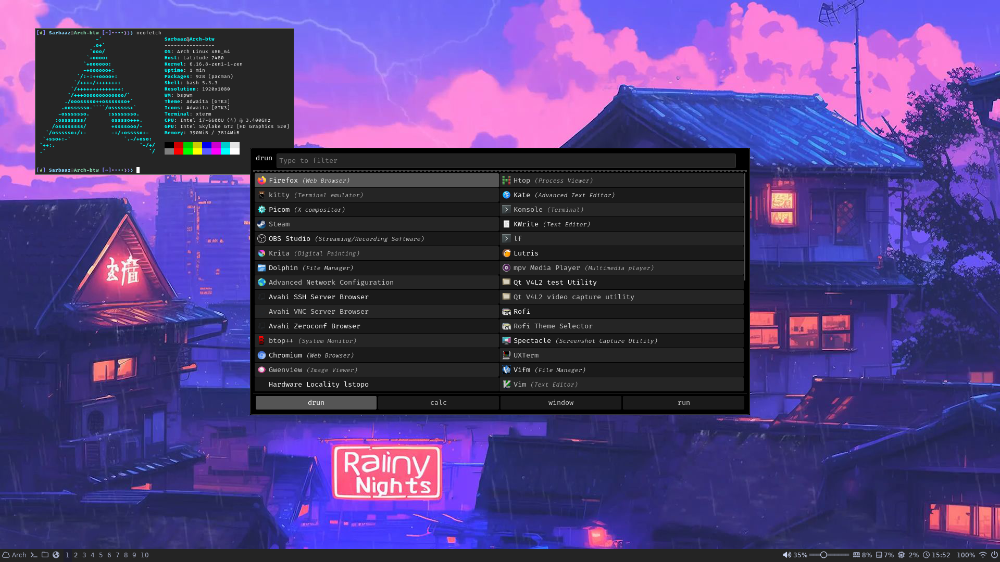
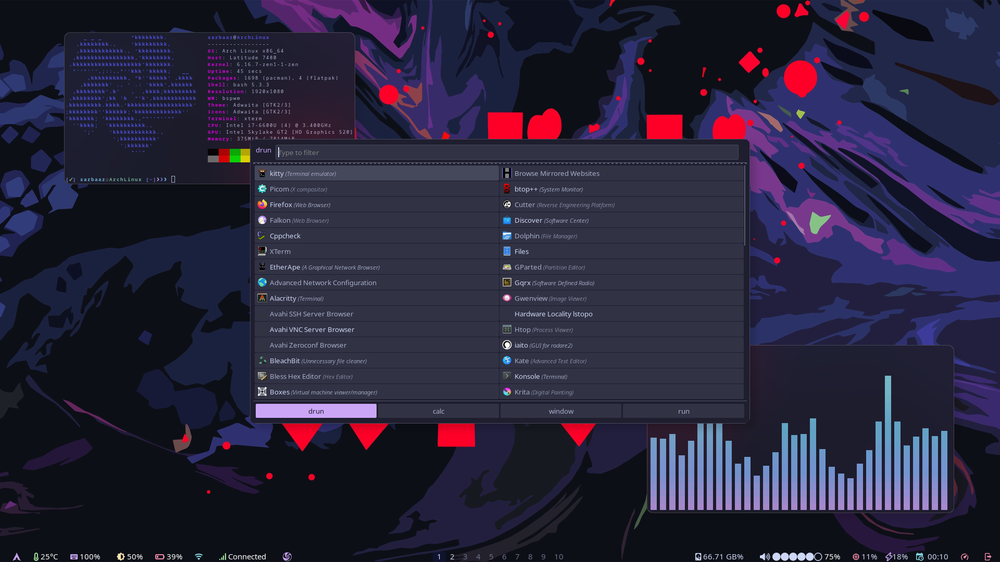
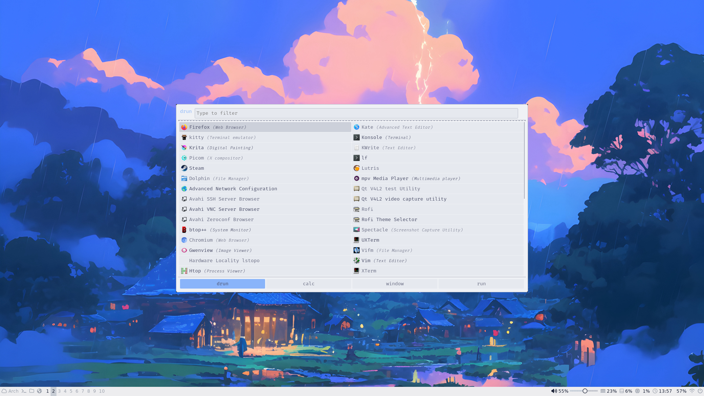
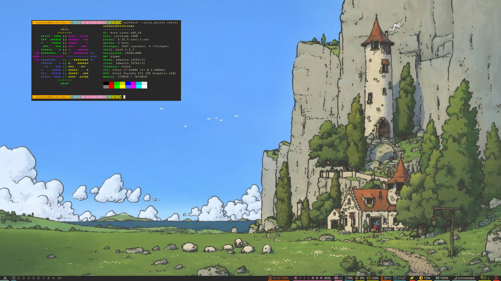
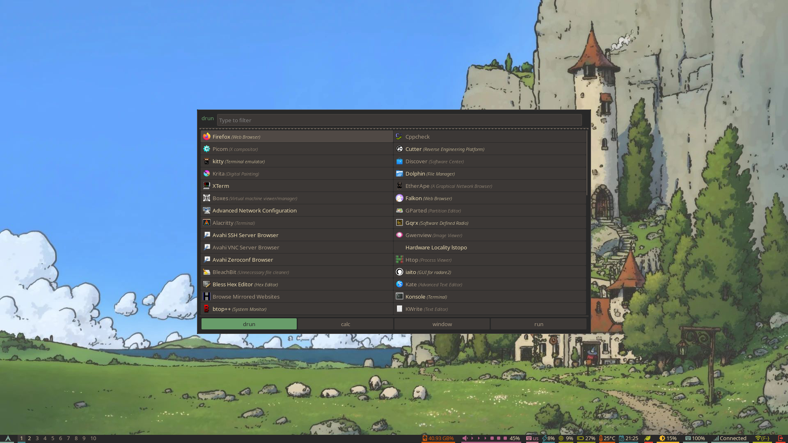
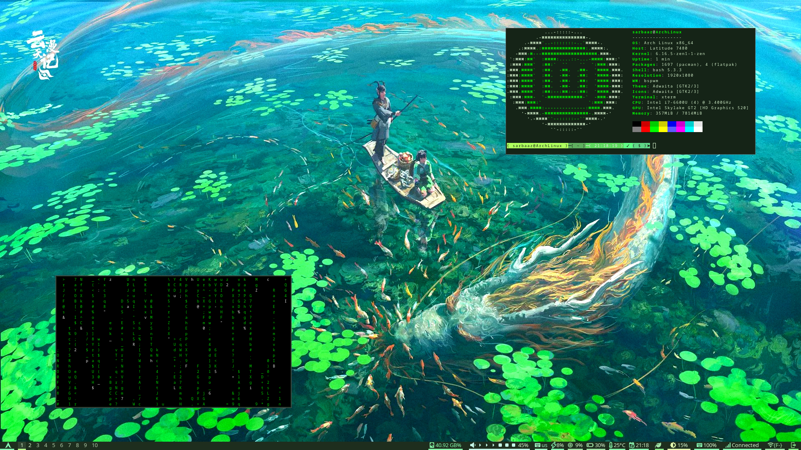
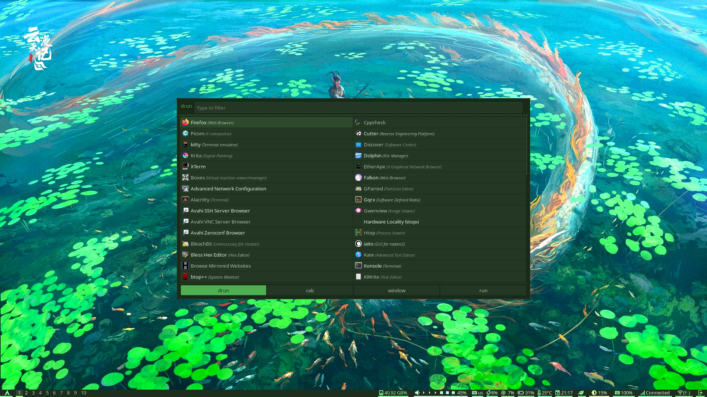

# ARCH-LINUX-BSPWM-MINIMAL-DESKTOP

# DEPENDENCIES 
.
sudo pacman -S bspwm polybar xterm picom rofi kitty scrot nm-connection-editor brightnessctl pamixer ffmpeg xorg-server xorg-xinit xorg-xrandr xf86-video-intel xorg-server xorg-apps xorg-xinit xorg-xkill xorg-xset xorg-xrandr xorg-xrdb xorg-xprop libqalculate intel-gpu-tools ffmpeg mpv xf86-video-fbdev xorg-xbacklight dmenu breeze-icons git nano curl wget less rust net-tools htop gwenview spectacle mplayer ttf-hack-nerd ttf-firacode-nerd papirus-icon-theme bc power-profiles-daemon python-gobject python unzip unrar p7zip ufw ttc-iosevka adobe-source-han-sans-jp-fonts feh stalonetray ttf-font-awesome ttf-nerd-fonts-symbols-common ttf-nerd-fonts-symbols-mono ttf-dejavu ttf-liberation noto-fonts noto-fonts-emoji ufw gparted dolphin git nano curl wget less rust net-tools htop

# FONTS THAT I USE IN POLYBAR

sudo pacman -S ttf-iosevka
sudo pacman -S ttf-font-awesome
sudo pacman -S ttf-siji
sudo pacman -S ttf-unifont
sudo pacman -S adobe-source-han-sans-jp-fonts
sudo pacman -S noto-fonts-emoji

# Install from AUR using yay (if you have an AUR helper)

yay -S ttf-iosevka-custom
yay -S ttf-iosevka-nerd

#YAY
.
git clone https://aur.archlinux.org/yay.git ~/yay
cd ~/yay
makepkg -si --noconfirm

#YAY dependencies
.
yay -S wlogout nm-applet ttf-nerd-fonts-symbols ttf-nerd-fonts-symbols-mono xwinwrap-git noto-fonts-emoji otf-ipafont ttf-jetbrains-mono nerd-fonts-iosevka ttf-siji adobe-source-han-sans-jp-fonts
.

# AFTER

sudo chmod +x ~/.config/rofi/wifi.sh
sudo chmod +x .config/bspwm/bspwmrc
sudo chmod +x .config/sxhkd/sxhkdrc
.
win + t = terminal
.
for wifi you use
.
nmtui, nm-connection-editor on polybar

Keybinds are in .config/sxhkd/sxhkdrc

and copy the .Xresources and .Bashrc into /home

# EXTRA

#gaming
#user linux-zen kernel or linux-xanmod

sudo pacman -S linux-zen linux-zen-headers
yay -S linux-xanmod linux-xanmod-headers

#load kernel
sudo grub-mkconfig -o /boot/grub/grub.cfg

#dependencies
pacman -S chromium git steam gamemode mangohud wine-staging gamemode gamescope

#pipewire audio
sudo pacman -S pipewire pipewire-pulse pipewire-alsa wireplumber
systemctl --user enable --now pipewire pipewire-pulse wireplumber

######-AFTER START UP ON AFK IT USES AROUND 345 MB to 312 MB RAM/MEMORY-############
# REMOVE # FROM #.Xresources #.bashrc

# SCREENSHOT

# MOCHA-THEME

# LATTE-THEME

# GRUVBOX-THEME

# GREEN-THEME

